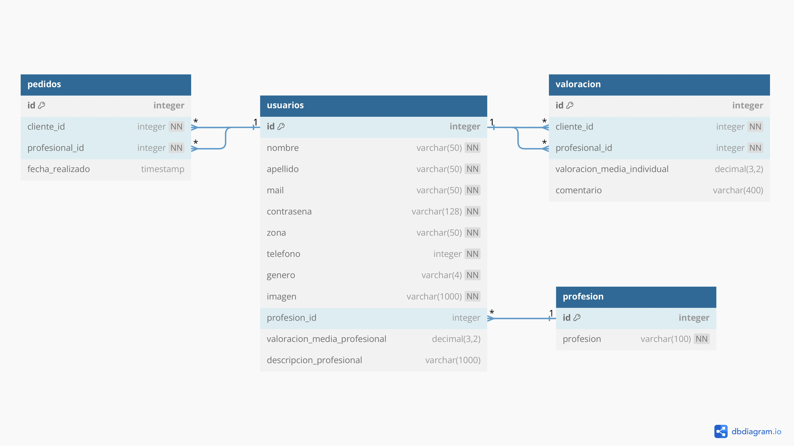

# Casa Lista  

## What is Casa Lista?  
Casa Lista is an application developed by students from the *Codo a Codo* program of the Buenos Aires City Government 🧑‍💻.  

The goal of Casa Lista is to help you easily find the right professional for your home 🏠, based on your location and service quality expectations 👩‍🏭👷.  

## About this repository  
This repository contains the **Backend** of the application, developed using **Python** 🐍 along with **Flask** as the backend framework and **MySQL** as the database engine 💽. The code in this repository is currently running on <a href="https://francoriggio.pythonanywhere.com/" rel="nofollow noreferrer">PythonAnywhere</a>.  

For the <a href="https://github.com/francoandresriggio/CasaListaCaC_Frontend" rel="nofollow noreferrer">Frontend of the application,</a> HTML, CSS, and JavaScript were used.  

## Database Design  

  

## Team  
- Eduardo Ojeda  
- Mauro Gabriel Pazos  
- Franco Andres Riggio  
- Silvia Gomez  

> 🌎 This documentation is available in **English**.  
> For the Spanish version, check [README_es.md](./README_es.md).  
