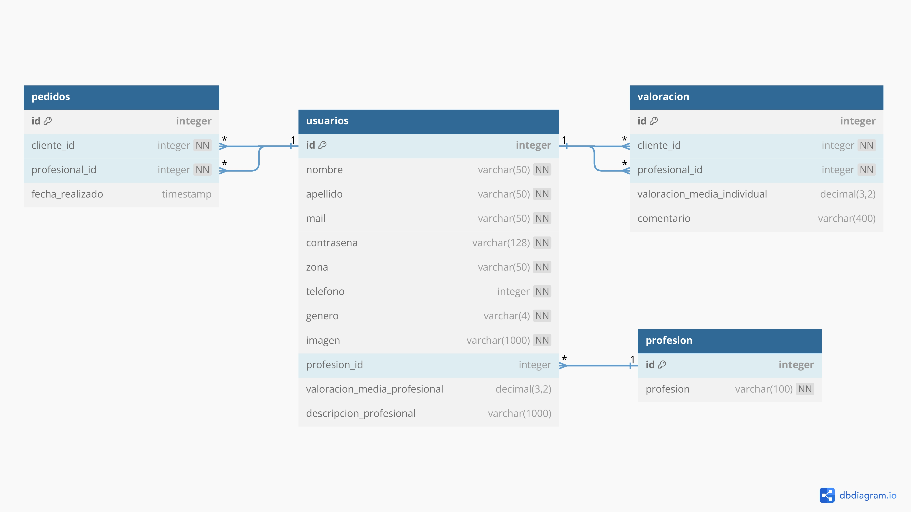

# Casa Lista
## ¿Qué es Casa Lista?
Casa Lista es una aplicación desarrollada por estudiantes del programa *Codo a Codo* del gobierno de la Ciudad de Buenos Aires 🧑‍💻.

El objetivo de Casa Lista es ayudarte a encontrar más fácil al profesional que necesitas para tu hogar 🏠, de acuerdo con tu zona y tus expectativas sobre la calidad del servicio brindado 👩‍🏭👷

## ¿De qué trata este repositorio?
Este repositorio muestra el **Backend** de la aplicación realizada, el cual fue desarrollado utilizando **Python** 🐍 como lenguaje, en conjunto con **Flask** como framework para el desarrollo del backend del sitio, y **MySQL** como motor de base de datos 💽. El código que se muestra en este repositorio está siendo ejecutado en <a href="https://francoriggio.pythonanywhere.com/" rel="nofollow noreferrer">pythonanywhere</a>.

Para el <a href="https://github.com/francoandresriggio/CasaListaCaC_Frontend" rel="nofollow noreferrer">Frontend de la aplicación,</a> se utilizó HTML, CSS y JS.

## Diseño de la base de datos

## Equipo
- Eduardo Ojeda
- Mauro Gabriel Pazos
- Franco Andres Riggio
- Silvia Gomez